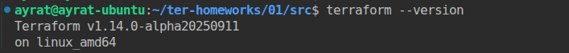
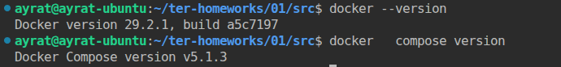
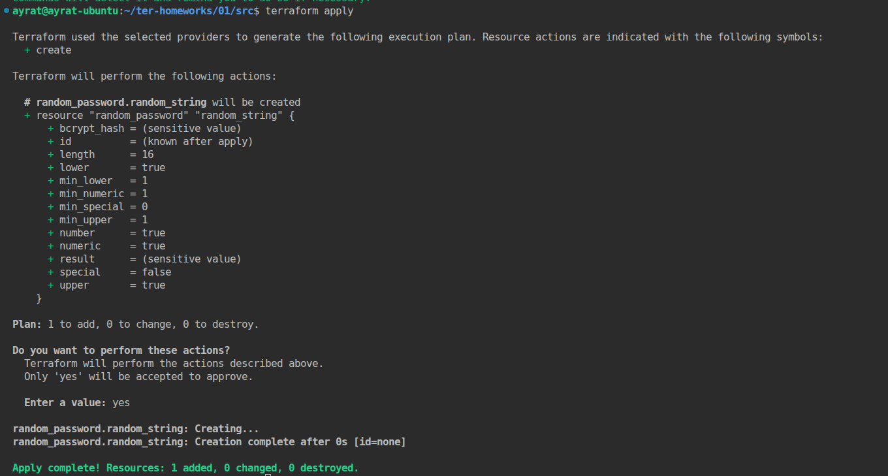
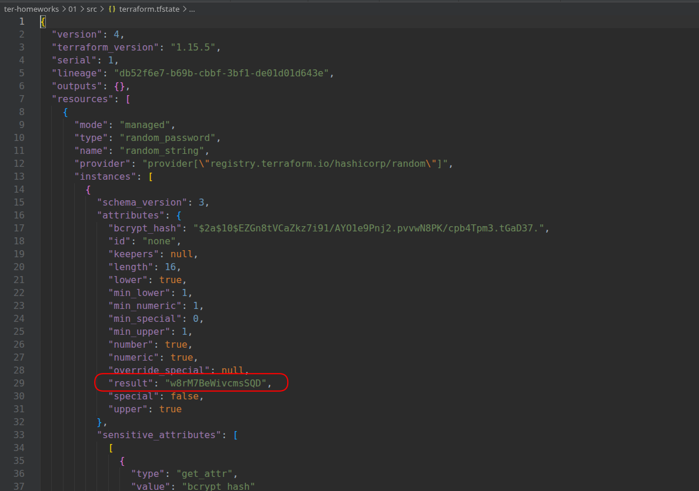
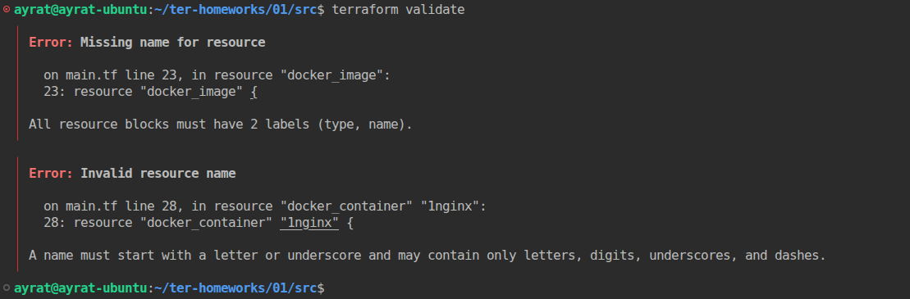
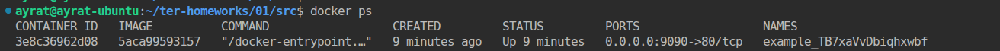
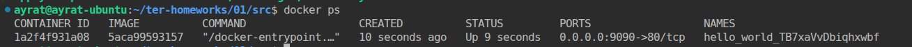
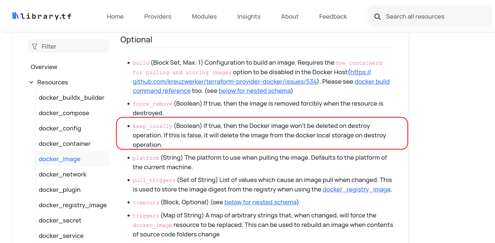

# Домашнее задание к занятию «Введение в Terraform» Тукаев Айрат

### Цели задания

1. Установить и настроить Terrafrom.
2. Научиться использовать готовый код.

------

### Чек-лист готовности к домашнему заданию

1. Скачайте и установите **Terraform** версии >=1.12.0 . Приложите скриншот вывода команды ```terraform --version```.
2. Скачайте на свой ПК этот git-репозиторий. Исходный код для выполнения задания расположен в директории **01/src**.
3. Убедитесь, что в вашей ОС установлен docker.

------

### Инструменты и дополнительные материалы, которые пригодятся для выполнения задания

1. Репозиторий с ссылкой на зеркало для установки и настройки Terraform: [ссылка](https://github.com/netology-code/devops-materials).
2. Установка docker: [ссылка](https://docs.docker.com/engine/install/ubuntu/). 
------
### Внимание!! Обязательно предоставляем на проверку получившийся код в виде ссылки на ваш github-репозиторий!
------

### Задание 1

1. Перейдите в каталог [**src**](https://github.com/netology-code/ter-homeworks/tree/main/01/src). Скачайте все необходимые зависимости, использованные в проекте. 
2. Изучите файл **.gitignore**. В каком terraform-файле, согласно этому .gitignore, допустимо сохранить личную, секретную информацию?(логины,пароли,ключи,токены итд)
3. Выполните код проекта. Найдите  в state-файле секретное содержимое созданного ресурса **random_password**, пришлите в качестве ответа конкретный ключ и его значение.
4. Раскомментируйте блок кода, примерно расположенный на строчках 29–42 файла **main.tf**.
Выполните команду ```terraform validate```. Объясните, в чём заключаются намеренно допущенные ошибки. Исправьте их.
5. Выполните код. В качестве ответа приложите: исправленный фрагмент кода и вывод команды ```docker ps```.
6. Замените имя docker-контейнера в блоке кода на ```hello_world```. Не перепутайте имя контейнера и имя образа. Мы всё ещё продолжаем использовать name = "nginx:latest". Выполните команду ```terraform apply -auto-approve```.
Объясните своими словами, в чём может быть опасность применения ключа  ```-auto-approve```. Догадайтесь или нагуглите зачем может пригодиться данный ключ? В качестве ответа дополнительно приложите вывод команды ```docker ps```.
8. Уничтожьте созданные ресурсы с помощью **terraform**. Убедитесь, что все ресурсы удалены. Приложите содержимое файла **terraform.tfstate**. 
9. Объясните, почему при этом не был удалён docker-образ **nginx:latest**. Ответ **ОБЯЗАТЕЛЬНО НАЙДИТЕ В ПРЕДОСТАВЛЕННОМ КОДЕ**, а затем **ОБЯЗАТЕЛЬНО ПОДКРЕПИТЕ** строчкой из документации [**terraform провайдера docker**](https://library.tf/providers/kreuzwerker/docker/latest).  (ищите в классификаторе resource docker_image )


**Выполнение:**  
1. Скачал все необхождимые зависимости. Terraform и docker установлены.    
   
   

2. Изучил файл **.gitignore**. В файле "personal.auto.tfvars" допустимо сохранить личную, секретную информацию.  
3. Выполнил код проекта.  
```
terraform init
terraform apply
```
     

  В файле **terraform.tfstate** нашёл ключ и его значение. ```"result": "w8rM7BeWivcmsSQD"```  
      
4. Раскомментировал блок кода файла **main.tf**.
Выполнил команду ```terraform validate```.  
     

 Первая ошибка указывает, что не указано имя ресурса. Исправляю:  
```
resource "docker_image" "nginx"{
  name         = "nginx:latest"
  keep_locally = true
}
```
 Вторая ошибка в имени ресурса. Она не может начинаться с цифры. Также здесь имеется ошибки в строке name. Переменная "random_string_FAKE" не объявлена, должна быть "random_string". "resulT" последняя буква заглавная. Исправляю:  
```
resource "docker_container" "nginx_container" {
  image = docker_image.nginx.image_id
  name  = "example_${random_password.random_string.result}"

  ports {
    internal = 80
    external = 9090
  }
}
```

5. Выполнил код. Вывод команды ```docker ps```.  
     

6. Заменил имя docker-контейнера в блоке кода на ```hello_world```. Выполнил команду ```terraform apply -auto-approve```.  
  Применение ключа ```-auto-approve``` может быть опасным, так как он позволяет автоматически применять план изменений без возможности проверить его перед выполнением. Может привести к тому, что ошибки в конфигурации или непредвиденные последствия останутся незамеченными до момента применения. Может быть полезен в автоматизированных процессах (CI/CD) или при наличии строгого контроля над изменениями инфраструктуры.  
     

8. Уничтожил созданные ресурсы с помощью команды ```terraform destroy```. Убедился, что все ресурсы удалены. Содержимое файла **terraform.tfstate**:   
```
{
  "version": 4,
  "terraform_version": "1.15.5",
  "serial": 61,
  "lineage": "db52f6e7-b69b-cbbf-3bf1-de01d01d643e",
  "outputs": {},
  "resources": [],
  "check_results": null
}
```

9. При уничтожений ресурсов docker-образ **nginx:latest** не был удалён, так как ```keep_locally = true```. При значений true образ докера не будет удалён. 
     


------

## Дополнительное задание (со звёздочкой*)

**Настоятельно рекомендуем выполнять все задания со звёздочкой.** Они помогут глубже разобраться в материале.   
Задания со звёздочкой дополнительные, не обязательные к выполнению и никак не повлияют на получение вами зачёта по этому домашнему заданию. 

### Задание 2*

1. Создайте в облаке ВМ. Сделайте это через web-консоль, чтобы не слить по незнанию токен от облака в github(это тема следующей лекции). Если хотите - попробуйте сделать это через terraform, прочитав документацию yandex cloud. Используйте файл ```personal.auto.tfvars``` и гитигнор или иной, безопасный способ передачи токена!
2. Подключитесь к ВМ по ssh и установите стек docker.
3. Найдите в документации docker provider способ настроить подключение terraform на вашей рабочей станции к remote docker context вашей ВМ через ssh.
4. Используя terraform и  remote docker context, скачайте и запустите на вашей ВМ контейнер ```mysql:8``` на порту ```127.0.0.1:3306```, передайте ENV-переменные. Сгенерируйте разные пароли через random_password и передайте их в контейнер, используя интерполяцию из примера с nginx.(```name  = "example_${random_password.random_string.result}"```  , двойные кавычки и фигурные скобки обязательны!) 
```
    environment:
      - "MYSQL_ROOT_PASSWORD=${...}"
      - MYSQL_DATABASE=wordpress
      - MYSQL_USER=wordpress
      - "MYSQL_PASSWORD=${...}"
      - MYSQL_ROOT_HOST="%"
```

6. Зайдите на вашу ВМ , подключитесь к контейнеру и проверьте наличие секретных env-переменных с помощью команды ```env```. Запишите ваш финальный код в репозиторий.

### Задание 3*
1. Установите [opentofu](https://opentofu.org/)(fork terraform с лицензией Mozilla Public License, version 2.0) любой версии
2. Попробуйте выполнить тот же код с помощью ```tofu apply```, а не terraform apply.
------


