# Домашнее задание к занятию «Основы Terraform. Yandex Cloud» Тукаев Айрат

### Цели задания

1. Создать свои ресурсы в облаке Yandex Cloud с помощью Terraform.
2. Освоить работу с переменными Terraform.


### Чек-лист готовности к домашнему заданию

1. Зарегистрирован аккаунт в Yandex Cloud. Использован промокод на грант.
2. Установлен инструмент Yandex CLI.
3. Исходный код для выполнения задания расположен в директории [**02/src**](https://github.com/netology-code/ter-homeworks/tree/main/02/src).


### Задание 0

1. Ознакомьтесь с [документацией к security-groups в Yandex Cloud](https://cloud.yandex.ru/docs/vpc/concepts/security-groups?from=int-console-help-center-or-nav). 
Этот функционал понадобится к следующей лекции.  

**Выполнение:**  
  Ознакомился с группами безопасности в Yandex Cloud.  

------
### Внимание!! Обязательно предоставляем на проверку получившийся код в виде ссылки на ваш github-репозиторий!
------


### Задание 1
В качестве ответа всегда полностью прикладывайте ваш terraform-код в git.
Убедитесь что ваша версия **Terraform** ~>1.12.0

1. Изучите проект. В файле variables.tf объявлены переменные для Yandex provider.
2. Создайте сервисный аккаунт и ключ. [service_account_key_file](https://terraform-provider.yandexcloud.net).
4. Сгенерируйте новый или используйте свой текущий ssh-ключ. Запишите его открытую(public) часть в переменную **vms_ssh_public_root_key**.
5. Инициализируйте проект, выполните код. Исправьте намеренно допущенные синтаксические ошибки. Ищите внимательно, посимвольно. Ответьте, в чём заключается их суть.
6. Подключитесь к консоли ВМ через ssh и выполните команду ``` curl ifconfig.me```.
Примечание: К OS ubuntu "out of a box, те из коробки" необходимо подключаться под пользователем ubuntu: ```"ssh ubuntu@vm_ip_address"```. Предварительно убедитесь, что ваш ключ добавлен в ssh-агент: ```eval $(ssh-agent) && ssh-add``` Вы познакомитесь с тем как при создании ВМ создать своего пользователя в блоке metadata в следующей лекции.;
8. Ответьте, как в процессе обучения могут пригодиться параметры ```preemptible = true``` и ```core_fraction=5``` в параметрах ВМ.

В качестве решения приложите:

- скриншот ЛК Yandex Cloud с созданной ВМ, где видно внешний ip-адрес;
- скриншот консоли, curl должен отобразить тот же внешний ip-адрес;
- ответы на вопросы.

**Выполнение:**  
 Изучил проект. Сервисный аккаунт и ключ были созданы ранее. Записал свой текущий ssh-ключ (public) в переменную **vms_ssh_public_root_key**. 
 Инициализировал проект и запустил код. Получил ошибку:  
  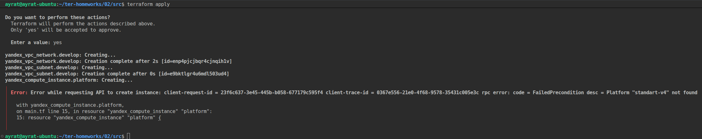

 "Платформа "standart-v4" не найдена". 
```
resource "yandex_compute_instance" "platform" {
  name        = "netology-develop-platform-web"
  platform_id = "standart-v4"
  resources {
    cores         = 1
    memory        = 1
    core_fraction = 5
  }

```
 Ошибка в написаний "standart", правильно "standard". Также не существует такой платформы на яндекс клауд "standard-v4". Есть "standard-v4а". Исправляю и запускаю код.  
 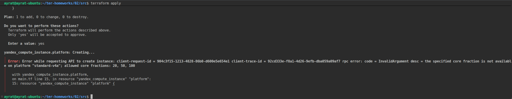

 Следующая ошибка в неверно указанной гарантированной доли ЦПУ (core_fraction = 5). Могут быть значения 20, 50, 100 %. Исправляю и запускаю код повторно. Получаю третью ошибку.  
 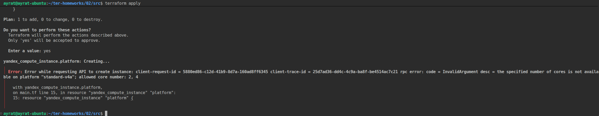

 Неверно указано количество ядер. Она не может быть 1. Ставлю 2.  
 После запуска код успешно отработал:  
 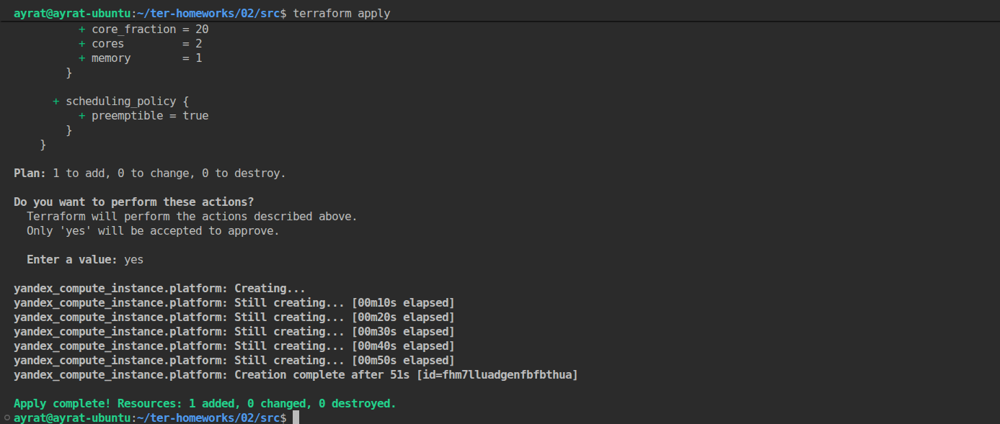

 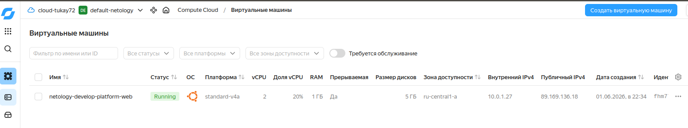

 Подключился к консоли ВМ через ssh ```ssh ubuntu@89.169.136.18``` и выполнил команду ``` curl ifconfig.me```.  
 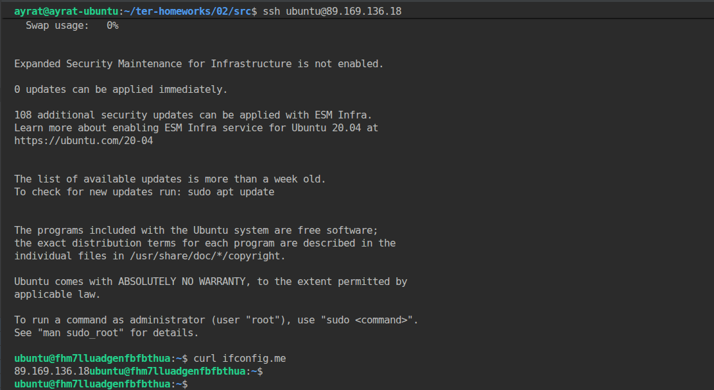

 На время процесса обучения нам выдан грант на использование ресурсов в Yandex Cloud. Чтоб его хватило на время обучения необходимо использоваить экономно. Для этого нам пригодяться параметры ```preemptible = true``` и ```core_fraction=5``` в параметрах ВМ.  
 ```preemptible = true```  - этот параметр позволяет создавать "прерываемые" ВМ. Это машины которые работают не более 24 часов и могут быть остановлены Compute Cloud в любой момент. После остановки ВМ не удаляются, все их данные сохраняются. Чтобы продолжить работу, нужно запустит ВМ повторно.  
 ```core_fraction=5```     - это гарантированная доля vCPU, которая будет выделена ВМ. ВМ с гарантированной долей меньше 100% обеспечивают указанный уровень производительности с вероятностью временного повышения вплоть до 100%. Такие ВМ подходят для задач, которые не требуют постоянной гарантии производительности vCPU на 100%.


### Задание 2

1. Замените все хардкод-**значения** для ресурсов **yandex_compute_image** и **yandex_compute_instance** на **отдельные** переменные. К названиям переменных ВМ добавьте в начало префикс **vm_web_** .  Пример: **vm_web_name**.
2. Объявите нужные переменные в файле variables.tf, обязательно указывайте тип переменной. Заполните их **default** прежними значениями из main.tf. 
3. Проверьте terraform plan. Изменений быть не должно. 

**Выполнение:**  
Заменил все хардкод-**значения** для ресурсов **yandex_compute_image** и **yandex_compute_instance** на **отдельные** переменные. Объявил нужные переменные в файле variables.tf.  

*variables.tf*  
```
variable "cloud_id" {
  type        = string
  description = "https://cloud.yandex.ru/docs/resource-manager/operations/cloud/get-id"
}

variable "folder_id" {
  type        = string
  description = "https://cloud.yandex.ru/docs/resource-manager/operations/folder/get-id"
}

variable "default_zone" {
  type        = string
  default     = "ru-central1-a"
  description = "https://cloud.yandex.ru/docs/overview/concepts/geo-scope"
}
variable "default_cidr" {
  type        = list(string)
  default     = ["10.0.1.0/24"]
  description = "https://cloud.yandex.ru/docs/vpc/operations/subnet-create"
}

variable "vpc_name" {
  type        = string
  default     = "develop"
  description = "VPC network & subnet name"
}


###ssh vars

variable "vms_ssh_root_key" {
  type        = string
  default     = "ssh-ed25519 AAAAC3NzaC1lZDI1NTE5AAAAIH8lnFOyyfXEG7RVccooTzblpajN4fXZJGBSdlwtwJGm ayrat@Ayrat"
  description = "ssh-keygen -t ed25519"
}

variable "vm_web_family" {
  type = string
  default = "ubuntu-2004-lts"
}

variable "vm_web_name" {
  type = string
  default = "netology-develop-platform-web"
}

variable "vm_web_platform_id" {
  type = string
  default = "standard-v4a"
}

variable "vm_web_cores" {
  type = number
  default = 2
}

variable "vm_web_memory" {
  type = number
  default = 1
}

variable "vm_web_core_fraction" {
  type = number
  default = 20
}
```

*main.tf*  
```
resource "yandex_vpc_network" "develop" {
  name = var.vpc_name
}
resource "yandex_vpc_subnet" "develop" {
  name           = var.vpc_name
  zone           = var.default_zone
  network_id     = yandex_vpc_network.develop.id
  v4_cidr_blocks = var.default_cidr
}


data "yandex_compute_image" "ubuntu" {
  family = var.vm_web_family
}
resource "yandex_compute_instance" "platform" {
  name        = var.vm_web_name
  platform_id = var.vm_web_platform_id
  resources {
    cores         = var.vm_web_cores
    memory        = var.vm_web_memory
    core_fraction = var.vm_web_core_fraction
  }
  boot_disk {
    initialize_params {
      image_id = data.yandex_compute_image.ubuntu.image_id
    }
  }
  scheduling_policy {
    preemptible = true
  }
  network_interface {
    subnet_id = yandex_vpc_subnet.develop.id
    nat       = true
  }

  metadata = {
    serial-port-enable = 1
    ssh-keys           = "ubuntu:${var.vms_ssh_root_key}"
  }

}
```  
Выполнил команду ```terraform plan```. Изменений нет.  
 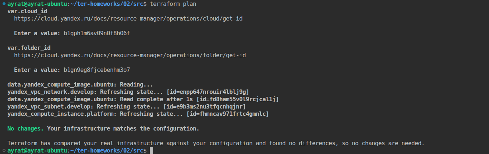


### Задание 3

1. Создайте в корне проекта файл 'vms_platform.tf' . Перенесите в него все переменные первой ВМ.
2. Скопируйте блок ресурса и создайте с его помощью вторую ВМ в файле main.tf: **"netology-develop-platform-db"** ,  ```cores  = 2, memory = 2, core_fraction = 20```. Объявите её переменные с префиксом **vm_db_** в том же файле ('vms_platform.tf').  ВМ должна работать в зоне "ru-central1-b"
3. Примените изменения.

**Выполнение:**  
  Создал в корне проекта файл 'vms_platform.tf' . Перенес в него все переменные первой ВМ.
Скопировал блок ресурса и создал с его помощью вторую ВМ согласно указанным параметрам:   
*vms_platform.tf*  
```
variable "vm_db_zone" {
  type        = string
  default     = "ru-central1-b"
}
variable "vm_db_cidr" {
  type        = list(string)
  default     = ["10.0.2.0/24"]
}


variable "vm_db_family" {
  type = string
  default = "ubuntu-2004-lts"
}

variable "vm_db_name" {
  type = string
  default = "netology-develop-platform-db"
}

variable "vm_db_platform_id" {
  type = string
  default = "standard-v4a"
}

variable "vm_db_cores" {
  type = number
  default = 2
}

variable "vm_db_memory" {
  type = number
  default = 2
}

variable "vm_db_core_fraction" {
  type = number
  default = 20
}

variable "vpc_vm_db_name" {
  type        = string
  default     = "develop-2"
}
```

*main.tf*  
```
resource "yandex_vpc_network" "develop" {
  name = var.vpc_name
}
resource "yandex_vpc_subnet" "develop" {
  name           = var.vpc_name
  zone           = var.default_zone
  network_id     = yandex_vpc_network.develop.id
  v4_cidr_blocks = var.default_cidr
}

resource "yandex_vpc_subnet" "develop-2" {
  name           = var.vpc_vm_db_name
  zone           = var.vm_db_zone
  network_id     = yandex_vpc_network.develop.id
  v4_cidr_blocks = var.vm_db_cidr
}

#web
data "yandex_compute_image" "ubuntu" {
  family = var.vm_web_family
}
resource "yandex_compute_instance" "platform" {
  name        = var.vm_web_name
  platform_id = var.vm_web_platform_id
  resources {
    cores         = var.vm_web_cores
    memory        = var.vm_web_memory
    core_fraction = var.vm_web_core_fraction
  }
  boot_disk {
    initialize_params {
      image_id = data.yandex_compute_image.ubuntu.image_id
    }
  }
  scheduling_policy {
    preemptible = true
  }
  network_interface {
    subnet_id = yandex_vpc_subnet.develop.id
    nat       = true
  }

  metadata = {
    serial-port-enable = 1
    ssh-keys           = "ubuntu:${var.vms_ssh_root_key}"
  }

}

#db
data "yandex_compute_image" "ubuntu2" {
  family = var.vm_db_family
}
resource "yandex_compute_instance" "platform2" {
  name        = var.vm_db_name
  platform_id = var.vm_db_platform_id
  zone        = var.vm_db_zone
  resources {
    cores         = var.vm_db_cores
    memory        = var.vm_db_memory
    core_fraction = var.vm_db_core_fraction
  }
  boot_disk {
    initialize_params {
      image_id = data.yandex_compute_image.ubuntu.image_id
    }
  }
  scheduling_policy {
    preemptible = true
  }
  network_interface {
    subnet_id = yandex_vpc_subnet.develop-2.id
    nat       = true
  }

  metadata = {
    serial-port-enable = 1
    ssh-keys           = "ubuntu:${var.vms_ssh_root_key}"
  }

}

``` 
 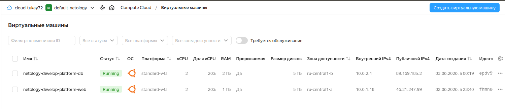
 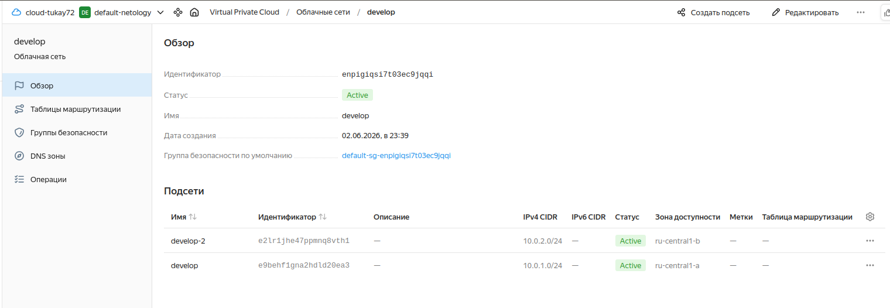


### Задание 4

1. Объявите в файле outputs.tf **один** output , содержащий: instance_name, external_ip, fqdn для каждой из ВМ в удобном лично для вас формате.(без хардкода!!!)
2. Примените изменения.

В качестве решения приложите вывод значений ip-адресов команды ```terraform output```.

**Выполнение:**  
*output.tf*  
```
output "vm_instances_info" {
  value = {
    vm_web = {
      instance_name = yandex_compute_instance.platform.name
      external_ip = yandex_compute_instance.platform.network_interface.0.nat_ip_address
      fqdn = yandex_compute_instance.platform.fqdn
    }
    vm_db = {
      instance_name = yandex_compute_instance.platform2.name
      external_ip = yandex_compute_instance.platform2.network_interface.0.nat_ip_address
      fqdn = yandex_compute_instance.platform2.fqdn
    }
  }
  description = "Information about VM instances: name, external IP, and FQDN."
}
```
Выполнил команду ```terraform output```. 
  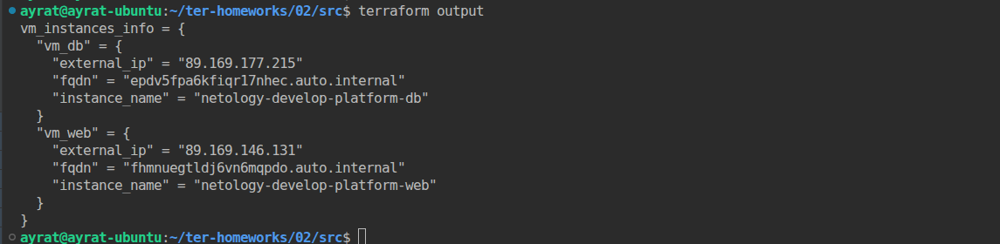
  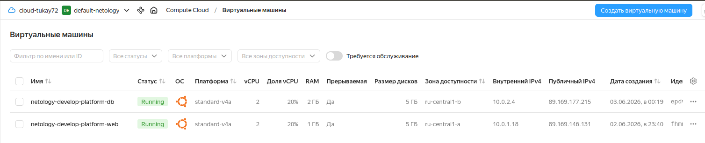


### Задание 5

1. В файле locals.tf опишите в **одном** local-блоке имя каждой ВМ, используйте интерполяцию ${..} с НЕСКОЛЬКИМИ переменными по примеру из лекции.
2. Замените переменные внутри ресурса ВМ на созданные вами local-переменные.
3. Примените изменения.

**Выполнение:**  
 В файле locals.tf описал в **одном** local-блоке имя каждой ВМ, используя интерполяцию ${..} с НЕСКОЛЬКИМИ переменными. Заменил переменные в файле main.tf. Выполнил команду ```terraform plan```. Изменений в проекте нет. 
   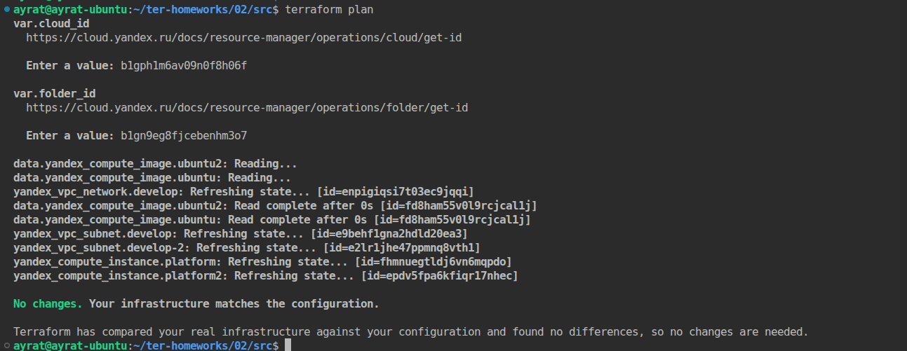


### Задание 6

1. Вместо использования трёх переменных  ".._cores",".._memory",".._core_fraction" в блоке  resources {...}, объедините их в единую map-переменную **vms_resources** и  внутри неё конфиги обеих ВМ в виде вложенного map(object).  
   ```
   пример из terraform.tfvars:
   vms_resources = {
     web={
       cores=2
       memory=2
       core_fraction=5
       hdd_size=10
       hdd_type="network-hdd"
       ...
     },
     db= {
       cores=2
       memory=4
       core_fraction=20
       hdd_size=10
       hdd_type="network-ssd"
       ...
     }
   }
   ```
2. Создайте и используйте отдельную map(object) переменную для блока metadata, она должна быть общая для всех ваших ВМ.
   ```
   пример из terraform.tfvars:
   metadata = {
     serial-port-enable = 1
     ssh-keys           = "ubuntu:ssh-ed25519 AAAAC..."
   }
   ```  
  
3. Найдите и закоментируйте все, более не используемые переменные проекта.
4. Проверьте terraform plan. Изменений быть не должно.

**Выполнение:**  
1. Вместо использования трёх переменных  ".._cores",".._memory",".._core_fraction" в блоке  resources {...}, объединил их в единую map-переменную **vms_resources** и  внутри неё конфиги обеих ВМ в виде вложенного map(object).  
*variables.tf*
```
variable "cloud_id" {
  type        = string
  description = "https://cloud.yandex.ru/docs/resource-manager/operations/cloud/get-id"
}

variable "folder_id" {
  type        = string
  description = "https://cloud.yandex.ru/docs/resource-manager/operations/folder/get-id"
}

variable "default_zone" {
  type        = string
  default     = "ru-central1-a"
  description = "https://cloud.yandex.ru/docs/overview/concepts/geo-scope"
}
variable "default_cidr" {
  type        = list(string)
  default     = ["10.0.1.0/24"]
  description = "https://cloud.yandex.ru/docs/vpc/operations/subnet-create"
}

variable "vpc_name" {
  type        = string
  default     = "develop"
  description = "VPC network & subnet name"
}


###ssh vars

variable "vms_ssh_root_key" {
  type        = string
  default     = "ssh-ed25519 AAAAC3NzaC1lZDI1NTE5AAAAIH8lnFOyyfXEG7RVccooTzblpajN4fXZJGBSdlwtwJGm ayrat@Ayrat"
  description = "ssh-keygen -t ed25519"
}

variable "vm_web_family" {
  type = string
  default = "ubuntu-2004-lts"
}

/*variable "vm_web_name" {
  type = string
  default = "netology-develop-platform-web"
}*/

variable "vm_web_platform_id" {
  type = string
  default = "standard-v4a"
}

/*variable "vm_web_cores" {
  type = number
  default = 2
}

variable "vm_web_memory" {
  type = number
  default = 1
}

variable "vm_web_core_fraction" {
  type = number
  default = 20
}*/

variable "vms_resources" {
  default = {
     web = {
       cores = 2
       memory = 1
       core_fraction = 20
     },
     db= {
       cores = 2
       memory = 2
       core_fraction = 20
     }
  }
}
```
*main.tf*
```
resource "yandex_vpc_network" "develop" {
  name = var.vpc_name
}
resource "yandex_vpc_subnet" "develop" {
  name           = var.vpc_name
  zone           = var.default_zone
  network_id     = yandex_vpc_network.develop.id
  v4_cidr_blocks = var.default_cidr
}

resource "yandex_vpc_subnet" "develop-2" {
  name           = var.vpc_vm_db_name
  zone           = var.vm_db_zone
  network_id     = yandex_vpc_network.develop.id
  v4_cidr_blocks = var.vm_db_cidr
}

#web
data "yandex_compute_image" "ubuntu" {
  family = var.vm_web_family
}
resource "yandex_compute_instance" "platform" {
  name        = local.vm_web_instance_name
  platform_id = var.vm_web_platform_id
  resources {
    cores         = var.vms_resources.web.cores
    memory        = var.vms_resources.web.memory
    core_fraction = var.vms_resources.web.core_fraction
  }
  boot_disk {
    initialize_params {
      image_id = data.yandex_compute_image.ubuntu.image_id
    }
  }
  scheduling_policy {
    preemptible = true
  }
  network_interface {
    subnet_id = yandex_vpc_subnet.develop.id
    nat       = true
  }

  metadata = {
    serial-port-enable = 1
    ssh-keys           = "ubuntu:${var.vms_ssh_root_key}"
  }

}

#db
data "yandex_compute_image" "ubuntu2" {
  family = var.vm_db_family
}
resource "yandex_compute_instance" "platform2" {
  name        = local.vm_db_instance_name
  platform_id = var.vm_db_platform_id
  zone        = var.vm_db_zone
  resources {
    cores         = var.vms_resources.db.cores
    memory        = var.vms_resources.db.memory
    core_fraction = var.vms_resources.db.core_fraction
  }
  boot_disk {
    initialize_params {
      image_id = data.yandex_compute_image.ubuntu.image_id
    }
  }
  scheduling_policy {
    preemptible = true
  }
  network_interface {
    subnet_id = yandex_vpc_subnet.develop-2.id
    nat       = true
  }

  metadata = {
    serial-port-enable = 1
    ssh-keys           = "ubuntu:${var.vms_ssh_root_key}"
  }
}
```
Выполнил ```terraform plan```. Изменений нет.  
   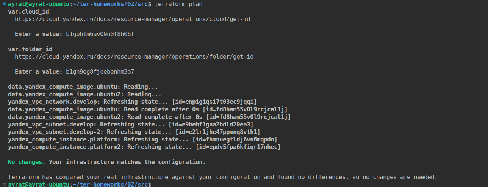

2. Создал отдельную map(object) общую переменную для блока metadata.  
*variables.tf*
```
variable "cloud_id" {
  type        = string
  description = "https://cloud.yandex.ru/docs/resource-manager/operations/cloud/get-id"
}

variable "folder_id" {
  type        = string
  description = "https://cloud.yandex.ru/docs/resource-manager/operations/folder/get-id"
}

variable "default_zone" {
  type        = string
  default     = "ru-central1-a"
  description = "https://cloud.yandex.ru/docs/overview/concepts/geo-scope"
}
variable "default_cidr" {
  type        = list(string)
  default     = ["10.0.1.0/24"]
  description = "https://cloud.yandex.ru/docs/vpc/operations/subnet-create"
}

variable "vpc_name" {
  type        = string
  default     = "develop"
  description = "VPC network & subnet name"
}


###ssh vars
/*
variable "vms_ssh_root_key" {
  type        = string
  default     = "ssh-ed25519 AAAAC3NzaC1lZDI1NTE5AAAAIH8lnFOyyfXEG7RVccooTzblpajN4fXZJGBSdlwtwJGm ayrat@Ayrat"
  description = "ssh-keygen -t ed25519"
}
*/
variable "metadata" {
  default = {
    serial-port-enable = 1
    ssh-keys           = "ubuntu:ssh-ed25519 AAAAC3NzaC1lZDI1NTE5AAAAIH8lnFOyyfXEG7RVccooTzblpajN4fXZJGBSdlwtwJGm ayrat@Ayrat"
  }
}

variable "vm_web_family" {
  type = string
  default = "ubuntu-2004-lts"
}

/*variable "vm_web_name" {
  type = string
  default = "netology-develop-platform-web"
}*/

variable "vm_web_platform_id" {
  type = string
  default = "standard-v4a"
}

/*variable "vm_web_cores" {
  type = number
  default = 2
}

variable "vm_web_memory" {
  type = number
  default = 1
}

variable "vm_web_core_fraction" {
  type = number
  default = 20
}*/

variable "vms_resources" {
  default = {
     web = {
       cores = 2
       memory = 1
       core_fraction = 20
     },
     db= {
       cores = 2
       memory = 2
       core_fraction = 20
     }
  }
}
```
*main.tf*
```
resource "yandex_vpc_network" "develop" {
  name = var.vpc_name
}
resource "yandex_vpc_subnet" "develop" {
  name           = var.vpc_name
  zone           = var.default_zone
  network_id     = yandex_vpc_network.develop.id
  v4_cidr_blocks = var.default_cidr
}

resource "yandex_vpc_subnet" "develop-2" {
  name           = var.vpc_vm_db_name
  zone           = var.vm_db_zone
  network_id     = yandex_vpc_network.develop.id
  v4_cidr_blocks = var.vm_db_cidr
}

#web
data "yandex_compute_image" "ubuntu" {
  family = var.vm_web_family
}
resource "yandex_compute_instance" "platform" {
  name        = local.vm_web_instance_name
  platform_id = var.vm_web_platform_id
  resources {
    cores         = var.vms_resources.web.cores
    memory        = var.vms_resources.web.memory
    core_fraction = var.vms_resources.web.core_fraction
  }
  boot_disk {
    initialize_params {
      image_id = data.yandex_compute_image.ubuntu.image_id
    }
  }
  scheduling_policy {
    preemptible = true
  }
  network_interface {
    subnet_id = yandex_vpc_subnet.develop.id
    nat       = true
  }

  metadata = var.metadata
}

#db
data "yandex_compute_image" "ubuntu2" {
  family = var.vm_db_family
}
resource "yandex_compute_instance" "platform2" {
  name        = local.vm_db_instance_name
  platform_id = var.vm_db_platform_id
  zone        = var.vm_db_zone
  resources {
    cores         = var.vms_resources.db.cores
    memory        = var.vms_resources.db.memory
    core_fraction = var.vms_resources.db.core_fraction
  }
  boot_disk {
    initialize_params {
      image_id = data.yandex_compute_image.ubuntu.image_id
    }
  }
  scheduling_policy {
    preemptible = true
  }
  network_interface {
    subnet_id = yandex_vpc_subnet.develop-2.id
    nat       = true
  }
  metadata = var.metadata
}
```
Выполнил ```terraform plan```. Изменений нет.  
   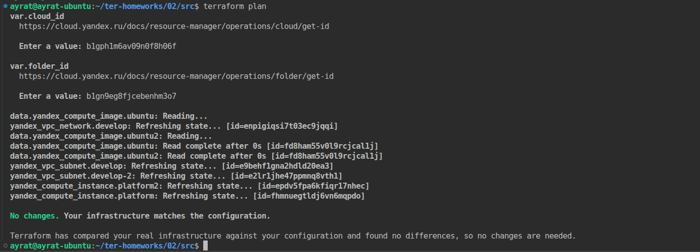


------

## Дополнительное задание (со звёздочкой*)

**Настоятельно рекомендуем выполнять все задания со звёздочкой.**   
Они помогут глубже разобраться в материале. Задания со звёздочкой дополнительные, не обязательные к выполнению и никак не повлияют на получение вами зачёта по этому домашнему заданию. 


------
### Задание 7*

Изучите содержимое файла console.tf. Откройте terraform console, выполните следующие задания: 

1. Напишите, какой командой можно отобразить **второй** элемент списка test_list.
2. Найдите длину списка test_list с помощью функции length(<имя переменной>).
3. Напишите, какой командой можно отобразить значение ключа admin из map test_map.
4. Напишите interpolation-выражение, результатом которого будет: "John is admin for production server based on OS ubuntu-20-04 with X vcpu, Y ram and Z virtual disks", используйте данные из переменных test_list, test_map, servers и функцию length() для подстановки значений.

**Примечание**: если не догадаетесь как вычленить слово "admin", погуглите: "terraform get keys of map"

В качестве решения предоставьте необходимые команды и их вывод.

------

### Задание 8*
1. Напишите и проверьте переменную test и полное описание ее type в соответствии со значением из terraform.tfvars:
```
test = [
  {
    "dev1" = [
      "ssh -o 'StrictHostKeyChecking=no' ubuntu@62.84.124.117",
      "10.0.1.7",
    ]
  },
  {
    "dev2" = [
      "ssh -o 'StrictHostKeyChecking=no' ubuntu@84.252.140.88",
      "10.0.2.29",
    ]
  },
  {
    "prod1" = [
      "ssh -o 'StrictHostKeyChecking=no' ubuntu@51.250.2.101",
      "10.0.1.30",
    ]
  },
]
```
2. Напишите выражение в terraform console, которое позволит вычленить строку "ssh -o 'StrictHostKeyChecking=no' ubuntu@62.84.124.117" из этой переменной.
------

------

### Задание 9*

Используя инструкцию https://cloud.yandex.ru/ru/docs/vpc/operations/create-nat-gateway#tf_1, настройте для ваших ВМ nat_gateway. Для проверки уберите внешний IP адрес (nat=false) у ваших ВМ и проверьте доступ в интернет с ВМ, подключившись к ней через serial console. Для подключения предварительно через ssh измените пароль пользователя: ```sudo passwd ubuntu```

### Правила приёма работыДля подключения предварительно через ssh измените пароль пользователя: sudo passwd ubuntu
В качестве результата прикрепите ссылку на MD файл с описанием выполненой работы в вашем репозитории. Так же в репозитории должен присутсвовать ваш финальный код проекта.

**Важно. Удалите все созданные ресурсы**.


### Критерии оценки

Зачёт ставится, если:

* выполнены все задания,
* ответы даны в развёрнутой форме,
* приложены соответствующие скриншоты и файлы проекта,
* в выполненных заданиях нет противоречий и нарушения логики.

На доработку работу отправят, если:

* задание выполнено частично или не выполнено вообще,
* в логике выполнения заданий есть противоречия и существенные недостатки. 

