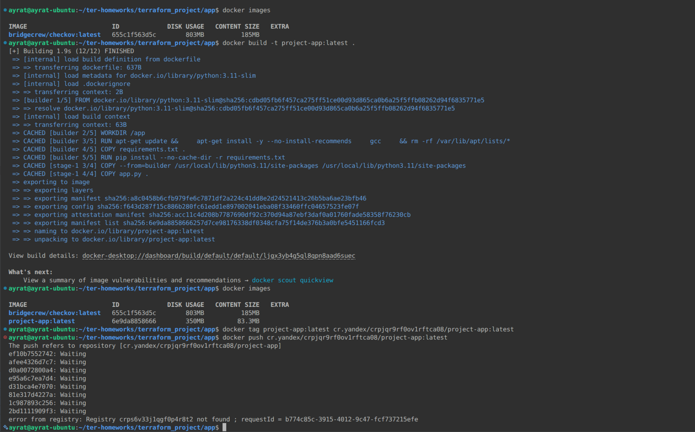
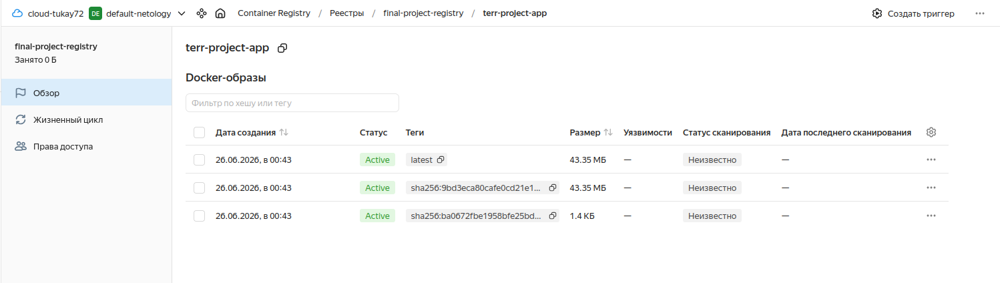

# Итоговый проект модуля «Облачная инфраструктура. Terraform» Тукаев Айрат

### Цель итогового проекта:
 - развернуть web-приложение для работы в облачной инфраструктуре Yandex Cloud.

### Задание 1. Развертывание инфраструктуры в Yandex Cloud.

   - Создайте Virtual Private Cloud (VPC).  
   - Создайте подсети.  
   - Создайте виртуальные машины (VM):  
        - Настройте группы безопасности (порты 22, 80, 443).  
        - Привяжите группу безопасности к VM.  
   - Опишите создание БД MySQL в Yandex Cloud.  
   - Опишите создание Container Registry.  


**Выполнение:**  
 Для создания сети, подсети и виртуальной машины использовал код из предыдущих заданий. Настроил и привязал группы безопасности к виртуальной машине.  
 Для создания БД MySQL в Yandex Cloud использовал [**документацию с Yandex Cloud**](https://yandex.cloud/ru/docs/managed-mysql/operations/cluster-create#tf_1).  
 Для создания БД создал файл  [mysql_db.tf](./mysql_db.tf).

    

    

    

  

 Далее создал Container Registry с помощью команды ```yc container registry create --name my-registry```.  
    

    


### Задание 2.   
 - Используя user-data (cloud-init), установите Docker и Docker Compose (см. Задания 5 модуля «Виртуализация и контейнеризация»).  


**Выполнение:**  
  Создал файл cloud-init.yml.tpl и с его помощью установил Docker и Docker Compose.  
*cloud-init.yml.tpl*
```
#cloud-config
package_update: true
package_upgrade: true
packages:
  - apt-transport-https
  - ca-certificates
  - curl
  - gnupg
  - lsb-release
write_files:
  - path: /opt/app/.env
    content: |
      DB_HOST=${db_host}
      DB_PORT=3306
      DB_USER=${db_user}
      DB_PASSWORD=${db_password}
      DB_NAME=${db_name}
  - path: /opt/app/docker-compose.yml
    content: |
      services:
        web:
          image: cr.yandex/${registry_id}/web-app:latest
          container_name: web-app
          restart: unless-stopped
          ports:
            - "80:80"
          env_file:
            - .env
          healthcheck:
            test: ["CMD", "python", "-c", "import urllib.request; urllib.request.urlopen('http://localhost:80/')"]
            interval: 30s
            timeout: 10s
            retries: 3
runcmd:
  - curl -fsSL https://download.docker.com/linux/ubuntu/gpg | sudo gpg --dearmor -o /usr/share/keyrings/docker-archive-keyring.gpg
  - echo "deb [arch=amd64 signed-by=/usr/share/keyrings/docker-archive-keyring.gpg] https://download.docker.com/linux/ubuntu $(lsb_release -cs) stable" | sudo tee /etc/apt/sources.list.d/docker.list > /dev/null
  - sudo apt-get update
  - sudo apt-get install -y docker-ce docker-ce-cli containerd.io docker-compose-plugin
  - sudo usermod -aG docker ubuntu
  - cd /opt/app && sudo docker compose up -d
```
    


### Задание 3.  
 - Опишите Docker файл (см. Задания 5 «Виртуализация и контейнеризация») c web-приложением и сохраните контейнер в Container Registry.  


**Выполнение:**  
 Создал поддиректорию и в нём создал три файла (dockerfile, app.py и requirements.txt). Выполнил сборку образа и тегрирование, пытался отправить в Yandex Container Registry. Неудачная отправка. Хотя идентификатор реестра указан верно. Код переделывал, первая отправка прошла без проблем. Сейчас в тупике. Роли и права доступа предоставлены.  

    

    

    


### Задание 4.  
 - Завяжите работу приложения в контейнере на БД в Yandex Cloud.  


**Выполнение:**  


