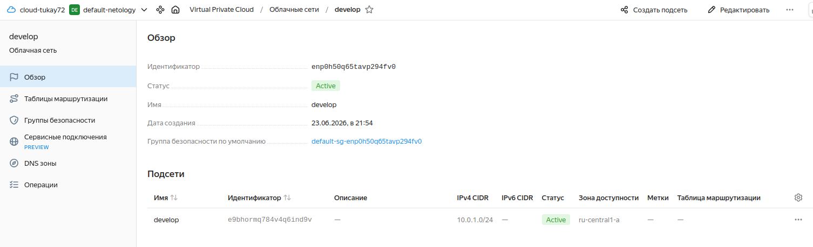
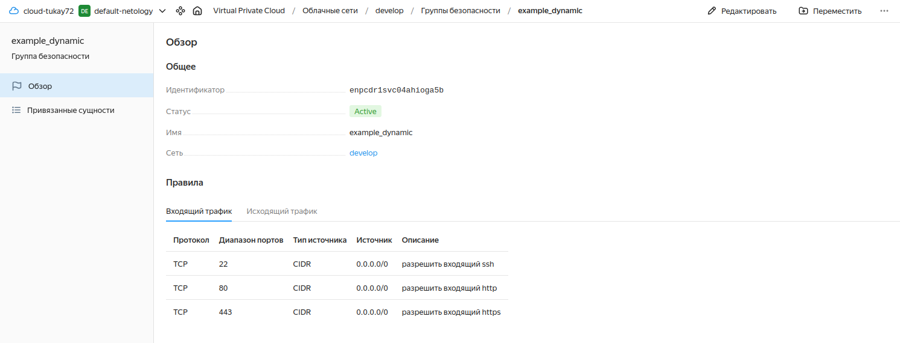
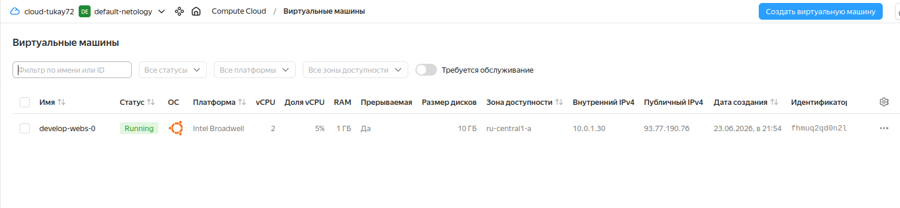
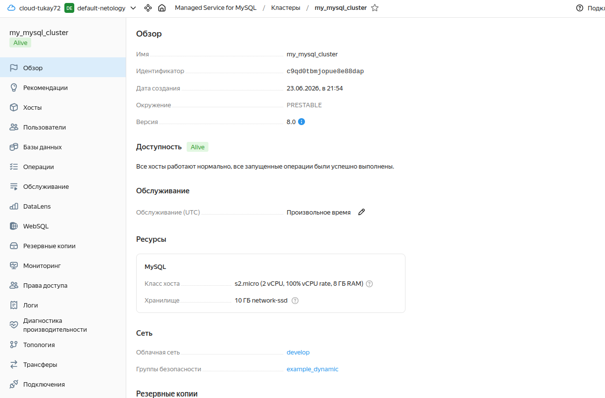
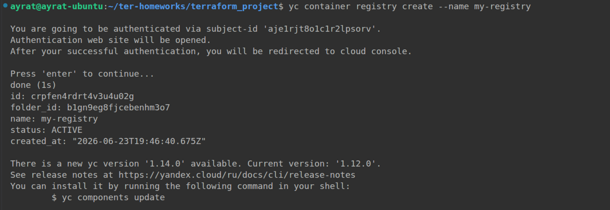
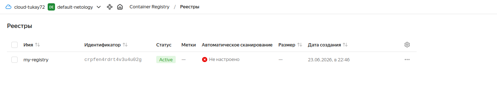
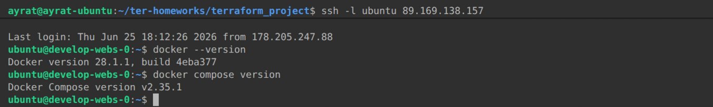

# Итоговый проект модуля «Облачная инфраструктура. Terraform» Тукаев Айрат

### Цель итогового проекта:
 - развернуть web-приложение для работы в облачной инфраструктуре Yandex Cloud.

### Задание 1. Развертывание инфраструктуры в Yandex Cloud.

   - Создайте Virtual Private Cloud (VPC).  
   - Создайте подсети.  
   - Создайте виртуальные машины (VM):  
        - Настройте группы безопасности (порты 22, 80, 443).  
        - Привяжите группу безопасности к VM.  
   - Опишите создание БД MySQL в Yandex Cloud.  
   - Опишите создание Container Registry.  


**Выполнение:**  
 Для создания сети, подсети и виртуальной машины использовал код из предыдущих заданий. Настроил и привязал группы безопасности к виртуальной машине.  
 Для создания БД MySQL в Yandex Cloud использовал [**документацию с Yandex Cloud**](https://yandex.cloud/ru/docs/managed-mysql/operations/cluster-create#tf_1).  
 Для создания БД создал файл  [mysql_db.tf](./mysql_db.tf).

    

    

    

  

 Далее создал Container Registry с помощью команды ```yc container registry create --name my-registry```.  
    

    


### Задание 2.   
 - Используя user-data (cloud-init), установите Docker и Docker Compose (см. Задания 5 модуля «Виртуализация и контейнеризация»).  


**Выполнение:**  
  Создал файл cloud-init.yml и с его помощью установил Docker и Docker Compose.  
*cloud-init.yml*
```
users:
  - name: ubuntu
    groups: sudo
    shell: /bin/bash
    sudo: ["ALL=(ALL) NOPASSWD:ALL"]
    ssh-authorized-keys:
      - ${ssh_public_key}
package_update: true
package_upgrade: true
runcmd:
  - sudo apt update
  - sudo apt install ca-certificates curl
  - sudo install -m 0755 -d /etc/apt/keyrings
  - sudo curl -fsSL https://download.docker.com/linux/ubuntu/gpg -o /etc/apt/keyrings/docker.asc
  - sudo chmod a+r /etc/apt/keyrings/docker.asc
  - sudo tee /etc/apt/sources.list.d/docker.sources <<EOF
   Types: deb
   URIs: https://download.docker.com/linux/ubuntu
   Components: stable
   Architectures: $(dpkg --print-architecture)
   Signed-By: /etc/apt/keyrings/docker.asc EOF
  - sudo apt update
  - sudo apt install -y docker-ce docker-ce-cli containerd.io docker-buildx-plugin docker-compose-plugin
```
    


### Задание 3.  
 - Опишите Docker файл (см. Задания 5 «Виртуализация и контейнеризация») c web-приложением и сохраните контейнер в Container Registry.  


**Выполнение:**  


### Задание 4.  
 - Завяжите работу приложения в контейнере на БД в Yandex Cloud.  


**Выполнение:**  


